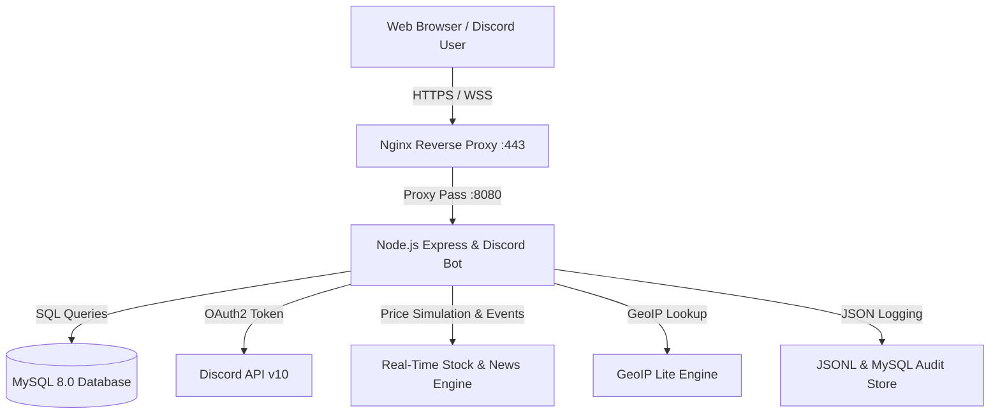

# 💎 월덕 디스코드 봇 & 가상 경제 웹 대시보드 시스템

> **실시간 가상 주식 시세 & 인터랙티브 차트, 경제 공시 속보, 골드 마이닝 클리커, 웹 카지노, 디스코드 봇 통합 플랫폼**  
> 🌐 **공식 라이브 웹사이트:** [https://easy-scraping.com](https://easy-scraping.com)

---

> 📚 **상세 문서**: [docs/SYSTEM_ARCHITECTURE.md](./docs/SYSTEM_ARCHITECTURE.md) · [운영 가이드](./docs/OPERATIONS.md) · [봇 명령어](./docs/BOT_COMMANDS.md) · [SQL 잠금 정책](./docs/SQL_LOCKDOWN_POLICY.md)

---

## 📌 목차
1. [프로젝트 소개](#-프로젝트-소개)
2. [핵심 기능 상세](#-핵심-기능-상세)
   - [📈 실시간 주식 시장 & 인터랙티브 차트](#1--실시간-주식-시장--인터랙티브-차트)
   - [📰 실시간 증시 속보 & 경제 공시 인텔리전스 허브](#2--실시간-증시-속보--경제-공시-인텔리전스-허브)
   - [⚡ 도박 턴(Turn) 시스템 & 중복 방지 락](#3--도박-턴turn-시스템--중복-방지-락)
   - [⛏️ 골드 마이닝 & 머니 클리커 게임](#4-️-골드-마이닝--머니-클리커-게임)
   - [🎰 웹 카지노 미니게임 허브](#5--웹-카지노-미니게임-허브)
   - [🎁 일일 경제 혜택 & 웹 뱅킹 센터](#6--일일-경제-혜택--웹-뱅킹-센터)
   - [👑 관리자 전용 실시간 관제 대시보드](#7--관리자-전용-실시간-관제-대시보드-admin)
3. [REST API 엔드포인트 명세](#-rest-api-엔드포인트-명세)
4. [디스코드 슬래시 명령어 목록](#-디스코드-슬래시-명령어-목록)
5. [기술 스택 & 시스템 아키텍처](#-기술-스택--시스템-아키텍처)
6. [배포 및 운영 가이드](#-배포-및-운영-가이드)

---

## 📖 프로젝트 소개

본 프로젝트는 **Discord.js (v14)** 기반의 고성능 디스코드 봇과 **Express.js + Vanilla CSS** 기반의 웹 프론트엔드를 완벽하게 결합한 실시간 가상 금융 & 게이밍 플랫폼입니다.

* **완벽한 데이터 동기화:** 디스코드 채팅창에서 획득한 자산과 웹사이트에서 획득한 자산(현금, 예금, 보유 주식, 도박 턴)이 **MySQL 8.0 데이터베이스를 통해 실시간으로 100% 동기화**됩니다.
* **Discord OAuth2 원클릭 로그인:** 디스코드 계정으로 간편하게 로그인하여 웹에서 직접 주식을 매매하고 카지노 게임과 클리커를 즐길 수 있습니다.
* **보안 & 관제 & 30일(1개월) 보관 정책:** 모든 웹 접속, 주가 변동, 거래 체결, 도박 이력, 관리자 활동은 GeoIP 국가 및 IP 정보와 함께 `.jsonl` 파일 및 MySQL DB에 안전하게 기록되며, **최대 30일(1개월) 동안 보관된 후 24시간 자동 스케줄러를 통해 안전하게 정돈**됩니다.

---

## ✨ 핵심 기능 상세

### 1. 📈 우리만의 독창적인 가상 커뮤니티 주식 생태계 (8대 기업)
* **🦆 `WTRD` - 월덕 인터내셔널 (지주사):** 월덕 봇 인프라 및 커뮤니티 전반을 총괄 운영하는 기축 지주사 (배당률 4.2%).
* **⛏️ `MINE` - 월덕 광업 & 제련 (채굴/골드):** 클리커 광산에서 채굴된 원석과 보석을 제련 유통하는 자원 기업.
* **🎰 `CASN` - 황금오리 카지노 & 엔터 (게이밍):** 슬롯머신, 주사위, 코인플립 등 카지노 시설을 독점 운영하는 엔터 복합사.
* **🏦 `BANK` - 덕스 중앙은행 & 파이낸스 (금융):** 예금 보관, 기본소득 구제 지원금 집행을 전담하는 초우량 국책 금융기관 (배당률 5.5%).
* **🐱 `NEKO` - 네코 에너지 & 냥코 랩스 (양자):** 고양이 꾹꾹이 파동 상온 초전도체와 양자 칩셋을 개발하는 최고 변동성 미래 테마주.
* **🍗 `CHKN` - 황금닭 치킨 & 푸드 테크 (소비재):** 유저들의 야식과 스테미나 회복을 책임지는 국민 프랜차이즈 기업.
* **⚡ `SLOT` - 럭키세븐 다이아 복권 (복권/초보):** 1,000원의 저렴한 가격으로 누구나 매수 가능한 잭팟 복권 발행사.
* **🌐 `SCRP` - 이지스크랩 데이터 테크 (빅데이터):** 초당 10만 건의 웹 데이터를 가공 분석하는 고속 데이터 빅테크 기업.
* **고해상도 SVG 궤적 차트:** 최근 50회 가격 변동 틱을 부드러운 라인 및 그라데이션 영역 차트로 시각화.
* **원클릭 웹 트레이딩:** 모달 창에서 수량 입력 시 총 정산 금액 자동 계산 및 원클릭 `[🛒 매수]` / `[💰 매도]` 체결.

---

### 2. ⚡ 관리자 전용 실시간 모든 시스템 로그 스트림 (`/admin` 및 관리자 탭)
* **관리자 전용 보안 통제:** 모든 주가 변동 틱 로그, 주식 매매 체결 내역, 카지노 감사 로그, 경제 지원금 로그는 **인가된 관리자 계정(`config.isAdmin`)에만 접근 및 렌더링**됩니다.
* **3초 자동 갱신 라이브 피드:**
  * 📈 **실시간 주가 변동 틱 로그 (`stock_price_logs`):** 종목별 실시간 가격 변동, 등락률(▲/▼ %), 변동 사유, 시장 장세 기록
  * 🛒 **실시간 주식 매매 체결 로그 (`stock_transactions`):** 유저별 매수/매도 수량, 단가, 총 결제액 체결 기록
  * 🎰 **카지노 배팅 & 당첨 로그 (`gambling_logs`):** 슬롯, 동전, 주사위 배팅금, 당첨금, 손익 상세 기록
  * 🎁 **경제 지원금 & 은행 이체 로그 (`economy_logs`):** 출석체크, 기본소득, 은행 입출금 전후 잔고 기록
  * 📰 **실시간 증시 공시 속보 (`market_news_feed`):** 30종 이상의 경제 이벤트 실시간 피드
* **실시간 카테고리 필터 & 통합 검색:**
  * `[전체 로그]`, `[📈 주가 변동]`, `[🛒 주식 체결]`, `[🎰 카지노]`, `[🎁 경제지원]`, `[📰 공시/뉴스]` 원클릭 필터 및 실시간 키워드 검색.
* **사용자 친화적 플로팅 토스트 UI:**
  * 브라우저 기본 경고창(`alert`)을 전면 개선하여 화면 우상단에 부드럽게 나타나는 **다크 글래스모피즘 플로팅 토스트 알림창 (`showToast`)** 적용.

---

### 3. 🎰 도박 턴(Turn) 완전 폐지 & 무제한 자유 배팅 & 원클릭 잔고 롤백
* **도박 턴 시스템 전면 폐지:** 턴 제한 없이 유저가 보유한 현금만으로 슬롯머신, 동전 던지기, 주사위 대결을 100% 무제한 플레이 가능.
* **🔥 정밀 올인(All-In) 배팅 지원:**
  * 올인 버튼 클릭 시 현재 보유 중인 현금 전액(`userCash`)을 자동 산정하여 정밀하게 단판 승부 진행.
  * 잭팟 및 승리 시 배팅금액에 비례하여 정확한 배수(슬롯 최대 50배, 동전 1.95배, 주사위 2.0배) 지급.
* **🛡️ 게임 끝나기 전 재실행(스팸 연타) 방지 락:**
  * 프론트엔드 액션 락: 애니메이션 진행 중 모든 버튼 비활성화(`disabled`) 및 반투명 잠금 처리.
  * 백엔드 서버 락: 유저 ID 단위 In-Flight 요청 락(`activeGameUsers`) 적용 (연타/스크립트 시 429 차단).
* **⏪ 이전 잔고 원상 롤백 & 복구 시스템 (History & Rollback Center):**
  * 모든 도박 시 **도박 전 잔고(`balance_before`), 도박 후 잔고(`balance_after`), 당첨금, 게임 세부 결과**가 영구 DB에 기록.
  * 관리자 패널(`/admin`)에서 **`[⏪ 이전 잔고 복구]` 버튼**을 클릭하여 클릭 한 번으로 이전 잔고로 즉시 원상 복구 가능.
  * 디스코드 `/admin_rollback [유저]` 명령어로 디스코드에서도 즉시 롤백 가능.

---

### 4. ⛏️ 골드 마이닝 & 머니 클리커 게임
* **대형 인터랙티브 광석 클릭:** 보석을 클릭할 때마다 실시간 채굴 플로팅 애니메이션 발생.
* **15% 크리티컬 5배 대박 & 도박 턴 드랍:** 연타 채굴 시 높은 확률로 보너스 획득.
* **채굴 상점 업그레이드:**
  * 🔨 **클릭 파워 강화:** 클릭당 채굴량 증가 (+100원/Lv)
  * 🤖 **자동 채굴 봇:** 방치형 초당 자동 현금 채굴 (+300원/s/Lv)
  * ⚡ **도박 턴 긴급 25개 충전팩**
* **디스코드 `/클리커` 명령어 연동:** 디스코드 임베드 버튼 클릭을 통한 인게임 채굴 지원.

---

### 5. 🎰 웹 카지노 미니게임 허브
* **🎰 3릴 애니메이션 슬롯머신:** 다이아몬드(50배), 7(20배), 골든벨(10배), 포도(5배), 레몬(3배), 체리(2배) 당첨금 지급.
* **🪙 3D 동전 던지기 (1.95배):** 앞면/뒷면 선택 후 3D 회전 애니메이션과 함께 적중 시 보상.
* **🎲 주사위 대결 (2.0배):** 유저 주사위 2개 vs 딜러 주사위 2개 굴리기 대결 (무승부 시 환불).

---

### 6. 🎁 일일 경제 혜택 & 웹 뱅킹 센터
* **🎁 출석체크:** 일일 보상금 + 연속 출석 스트릭 보너스 + ⚡도박 턴 15개 지급.
* **🏛️ 기본소득 지원금:** 자산 50,000원 미만 시 50,000원 긴급 구제 지원금 + ⚡도박 턴 10개 지급.
* **🏦 은행 입출금:** 현금 ➔ 은행 예금 이체 및 출금 지원.

---

### 7. 👑 관리자 전용 실시간 관제 대시보드 (`/admin`)
* **관리자 권한 인증:** 디스코드 관리자 ID (`886478189520637992`, `889085646768078850`) 로그인 시에만 접근 가능.
* **GeoIP 국가 및 IP 추적:** 접속자의 IP, 국가 국기/국가명, 요청 URL, 소요 시간, HTTP 상태 코드 실시간 관제.
* **명령어 실행 감사 로그:** 유저별 슬래시 명령어 실행 옵션, 실행 시간, 성공/실패 여부 JSON 로깅.

---

## 📡 REST API 엔드포인트 명세

| Method | Endpoint | Description |
|---|---|---|
| `GET` | `/api/user/me` | 현재 로그인 유저의 자산, 도박 턴, 클리커 레벨, 보유 주식 조회 |
| `POST` | `/api/clicker/click` | 골드 채굴 클릭 및 도박 턴 획득 (배치 처리 지원) |
| `POST` | `/api/clicker/upgrade` | 클릭 파워, 자동 채굴 봇, 도박 턴 충전 업그레이드 |
| `POST` | `/api/game/slot` | 슬롯머신 실행 (1턴 소모, 중복 실행 방지 락) |
| `POST` | `/api/game/coinflip` | 동전 던지기 실행 (1턴 소모, 1.95배 보상) |
| `POST` | `/api/game/dice` | 주사위 대결 실행 (1턴 소모, 2.0배 보상) |
| `POST` | `/api/stock/trade` | 주식 실시간 매수/매도 주문 체결 |
| `GET` | `/api/stock/:stockId` | 종목 상세 분석 데이터 및 50틱 고해상도 차트 히스토리 조회 |
| `GET` | `/api/market/news` | 실시간 증시 속보 & 경제 공시 피드 조회 (카테고리 및 검색 지원) |
| `GET` | `/api/market` | 실시간 주식 시세, 상승세 랭킹, 시장 감성 요약 조회 |
| `GET` | `/api/leaderboard` | 자산가 순위표 TOP 10 조회 |
| `POST` | `/api/economy/daily` | 일일 출석체크 보상 수령 |
| `POST` | `/api/economy/subsidy` | 긴급 기본소득 구제 지원금 신청 |
| `POST` | `/api/economy/bank` | 은행 예금 입금 / 출금 |
| `GET` | `/api/admin/logs/access` | 관리자 전용 웹 접속 JSON 감사 로그 |
| `GET` | `/api/admin/logs/commands` | 관리자 전용 슬래시 명령어 JSON 실행 로그 |

---

## 🤖 디스코드 슬래시 명령어 목록

* **경제 및 자산 관리:**
 * `/지갑` : 본인 또는 타 유저의 현금, 예금, 주식 평가금, 총 순자산 및 서버 내 순위/백분위 조회
 * `/출석` : 일일 출석체크 보상 및 스트릭 보너스 수령
 * `/지원금` : 긴급 기본소득 구제 지원금 신청
 * `/송금` : 다른 유저에게 현금 이체
 * `/은행` : 은행 예금 입금 및 출금
 * `/일하기` : 미니 아르바이트를 통한 소정의 급여 획득
 * `/순위` : 서버 전체 자산가 랭킹 TOP 10 임베드 출력
* **골드 마이닝 클리커:**
 * `/클리커` : 디스코드 채팅창에서 인터랙티브 버튼으로 광석 채굴 및 곡괭이 강화
* **가상 주식 시스템:**
 * `/주식시세` : 전체 주식 종목 시세, 등락률, 아스키 차트 조회
 * `/주식차트` : 특정 종목의 가격 변동 추이 차트 조회
 * `/주식매수` : 원하는 수량만큼 주식 매수
 * `/주식매도` : 보유 주식 매도
 * `/포트폴리오` : 현재 보유 중인 주식 포트폴리오 및 수익률 분석
* **도박 & 카지노:**
 * `/도박` : 50% 확률 주사위 배팅
 * `/슬롯` : 3릴 슬롯머신 배팅 (최대 50배)
 * `/동전` : 앞면/뒷면 선택 동전 던지기 (1.9배)
 * `/블랙잭` : 딜러와의 21점 블랙잭 카드 게임
 * `/룰렛` : 레드/블랙/그린 룰렛 배팅
 * `/경마` : 말 번호를 골라 배팅하는 경마
 * `/도움말` : 명령어 목록
 * `/핑` : 봇 지연 확인
* **관리자 전용 명령어:**
 * `/admin_give` : 특정 유저에게 현금 지급 (관리자 전용 감사 로그 기록)
 * `/admin_take` : 특정 유저의 현금 회수
 * `/admin_reset` : 특정 유저의 경제 데이터 초기화
 * `/admin_stock` : 특정 종목 주가 강제 변동
 * `/admin_stats` : 서버 전체 경제 지표 및 유저 수 통계 조회
 * `/admin_rollback` : 최근 도박 결과를 이전 잔고로 복구
 * `/admin_reply` : 유저 문의에 답변
 * `/아이피` : IP 차단/해제/목록
* **유틸리티 & 음성:**
 * `/도움말`, `/핑`, `/문의`, `/말하기`, `/tts`

---

## 🛠️ 기술 스택 & 시스템 아키텍처



* **Backend / Engine:** Node.js 20, Express.js 5, Discord.js 14, mysql2
* **Frontend:** Vanilla JS (ES6+), Vanilla CSS (Tailored Design System, Sparkline SVG, CSS Grid/Flexbox)
* **Database:** MySQL 8.0 (`accountax_db`)
* **Server & Infra:** Ubuntu 24.04 LTS 미니 PC 서버, Nginx 1.28, Let's Encrypt SSL Certbot, PM2 Daemon Manager

---

## 🚀 배포 및 운영 가이드

### 1. 환경 변수 설정 (`.env`)
```env
DISCORD_TOKEN=your_discord_bot_token
DISCORD_CLIENT_ID=your_discord_client_id
DISCORD_CLIENT_SECRET=your_discord_client_secret
DISCORD_REDIRECT_URI=https://easy-scraping.com/auth/discord/callback

DB_HOST=127.0.0.1
DB_PORT=3306
DB_USER=wtrdd
DB_PASSWORD=your_db_password
DB_NAME=accountax_db

PORT=8080
ADMIN_IDS=886478189520637992,889085646768078850
```

### 2. 서비스 실행 및 관리 명령어
```bash
# 의존성 설치
npm install

# 로컬 문법 점검
node -c src/index.js

# PM2 서비스 실행 및 환경변수 갱신
pm2 start src/index.js --name "discord-bot" --update-env

# PM2 서비스 재시작
pm2 restart discord-bot --update-env

# 실시간 로그 확인
pm2 logs discord-bot --lines 30
```

---

## 🚀 최신 업데이트 내역 (2026-08)

### 🔍 1. Google Search Console & SEO & Googlebot 크롤링 완전 지원
- **웹 보안 쉴드(`security.js`) 화이트리스트 예외 처리**: `Googlebot`, `Google-Site-Verification`, `Google-InspectionTool`, `Storebot-Google`, `bingbot`, `Yeti`, `Daumoa` 등 공인 검색엔진의 Rate Limit 및 봇 차단 즉시 바이패스.
- **`robots.txt` & 동적 `sitemap.xml`**: 공개 페이지 및 18개 상장 주식 종목 링크를 포함한 실시간 사이트맵 자동 생성.
- **실시간 RSS 2.0 피드 (`/rss`, `/rss.xml`, `/feed`)**: 최신 20개 증시 뉴스 및 18개 종목 시황을 RSS 2.0 표준 규격으로 실시간 서빙.
- **Google 소유권 확인 자동 라우트 (`google*.html`)**: 구글 서치 콘솔 파일 인증 시 자동 승인 응답.

### 🏷️ 2. Google 태그 관리자 (Google Tag Manager) 전면 설치
- 웹사이트 전역(랜딩 홈, 대시보드, 이용약관, 개인정보처리방침, 관리자 관제 센터)에 **`GTM-58KTJGG4`** `<head>` 및 `<body>` 태그 설치 완료.

### 📜 3. 공식 서비스 이용약관 (`/terms`) & 법적 고지 배너
- **100% 무료 커뮤니티 가상 데이터 및 환전 불가 원칙** 명시 (현금/현물 환전 불가).
- 현금 거래(RMT) 시도 시 즉시 계정 영구 정지 및 데이터 몰수 조항 규정.
- 지식재산권, 면책 조항, 분쟁 해결 1:1 고객센터 창구 탑재 및 인쇄 지원.

### 💾 4. 자동화 데이터베이스 백업 시스템 (Node.js Native Dump Engine)
- **외부 바이너리 의존성 없는 순수 Node.js 스트리밍 MySQL 덤프 엔진** (`src/utils/backupEngine.js`) 탑재.
- **매 6시간 주기 백그라운드 자동 정기 백업** 및 30일 만료 백업 자동 롤링 정리.
- 관리자 웹 콘솔(`/admin/console`)에서 **[⚡ 지금 즉시 DB 백업 생성]** 및 브라우저 즉시 다운로드 지원.
- 디스코드 관리자 명령어 `/admin_backup [create/list]` 지원.

### 🏢 5. 사업(Business) 경제 밸런스 패치 (인플레이션 방지)
- 12개 점포별 기본 분당 수익 약 65%~70% 현실적 하향 조정하여 건전한 통화량 유지.
- 알바 인건비 지출 계수(5%) 및 채용비(0.25), 본사(HQ) 보너스(+3%/Lv) 재조정.
- 오프라인 수금 누적 상한을 6시간으로 단축하여 커뮤니티 활동성 촉진.

### ⏰ 6. 서버 및 데이터베이스 타임존 한국 표준시(KST) 완전 동기화
- 미니 PC 호스트 OS, MySQL Database, Docker Container 및 Node.js의 타임존을 `Asia/Seoul (KST, UTC+9)`로 100% 일치.
- 모든 파일 로그 및 DB 감사 로그의 밀리초 단위 한국 시간 기록 보장.

### 🌐 7. 거시경제 연동 전방위 자동 탄력 조절 시스템 (Dynamic Macroeconomic Engine)
- **10분 주기 시황·통화량·지니계수 분석 및 보상 자동 조절**:
  - 📉 **과열 / 인플레이션 (통화 과다)**: 사업 분당 매출 -20%~-35% 긴축, 누진 부유세 강화, 중앙은행 기준금리 인상.
  - 🚀 **침체 / 디플레이션 (불황)**: 사업 분당 매출 +15%~+35% 부양, 서민 생계지원금 +150% 대폭 확대, 세금 감면.
  - ⚖️ **빈부격차 심화 (양극화)**: 상위 1% 초부유층 누진세율 최대 3배 강화, 저소득층 기본소득 집중 지원.

### ⚖️ 8. 초고액 자산가 독점 방지 3중 누진 과세 & 국고 재분배 선순환
- **6단계 독점 억제 누진 부유세 (보유세)**: 500만(3%) ~ 50억 이상(20%) 10분 주기 자동 부과.
- **사업 고소득 누진 소득세 (원천징수)**: 순자산 1억 이상 부유층이 사업 수익 수금 시 6%~25% 세금 자동 환수.
- **고액 예금 이자 소득세 (원천징수)**: 예금 잔액 5,000만원 이상 유저에게 8%~20% 이자소득세 부과.
- **100% 국고 귀속 & 서민 복지 재분배**: 징수한 세금은 중앙은행 국고(`taxTreasury`)로 적립되어 파산 유저 구제 기본소득 및 전체 지원금 재원으로 100% 선순환.

### 📉 9. 주식 시장 상장폐지(Delisting), 정리매매, 청산 배당 및 신규 IPO 순환
- **상장적격성 심사 & 파산 상장폐지**: 주가 150원 이하 관리종목(`WARNING`), 80원 이하 정리매매(`DELISTING_SOON`), 30원 이하 파산 상장폐지(`DELISTED`).
- **🔥 주가 초과열 버블 붕괴 상장폐지 (`SUPER_BUBBLE`)**: 주가가 500만원 돌파 시 투자위험 경고 발령, 1,000만원 돌파 시 비이성적 투기 버블 붕괴로 강제 상장폐지 집행 후 주주들에게 현재가의 50%를 특별 대박 청산금으로 일괄 환급.
- **🚀 신규 혁신 기업 IPO 상장 풀 순환**: 상장폐지 시 대기 중인 혁신 기업(`QBIT`, `ROBO`, `AERO`, `NANO`, `GRID`, `META`) 자동 신규 상장.
- **👑 관리자 커스텀 주식 신규 상장 기능**:
  - 디스코드 `/admin_stock 추가 [종목코드] [종목명] [공모가] (섹터) (기업설명)`
  - 웹 API `POST /api/admin/action/stock-create`

### 💳 10. 관리자 자금 회수 시 마이너스 잔고(음수 채무) 전면 허용
- 관리자가 `/admin_take [유저] [금액]` 실행 시, 보유 현금보다 많은 금액을 회수하면 0원에서 멈추지 않고 차감액만큼 정확하게 마이너스 잔고(예: 10만원 보유 중 50만원 회수 시 -40만원)로 전환. (단, `금액:전액`인 경우 0원으로 회수)

### ⛏️ 11. 광산(클리커) 채굴 점검 차단 해제 및 정상 복원
- 광산 점검 차단 메시지를 완전히 제거하고 수동 클릭 채굴, 연타 배치, 크리티컬 5배 잭팟 및 상점 업그레이드 전면 정상화.

### 💸 12. 웹 & 디스코드 실시간 유저 자금 송금(이체) 시스템 전면 구축
- **🌐 웹 대시보드 인터랙티브 송금 센터 (`/api/economy/transfer`)**:
  - 지갑 퀵 액션 바의 **`[💸 송금]`** 버튼 클릭 시 실시간 송금 모달 팝업.
  - 상대방 닉네임 또는 Discord ID 자동완성 실시간 검색 (`/api/economy/users/search`).
  - 한글 단위(`5만`, `100만`, `1억`, `500양`, `전액`) 지원 및 송금세율 실시간 견적 (`/api/economy/transfer/quote`).
  - 송금 메모 입력 지원 및 양자 원자적 락(`withUserLock`)으로 잔고 이중 차감 및 데이터 꼬임 완벽 방지.
- **💬 디스코드 슬래시 명령어 (`/송금`)**:
  - `/송금 받을유저:@상대방 금액:5만 (단위:원)` 명령어로 디스코드 채팅창에서도 즉시 송금 가능.
- **🏛️ 공정한 송금세 국고 환수**: 송금 시 발생하는 송금세는 국고(`taxTreasury`)로 자동 귀속되어 서민 기본소득 재원으로 재분배.
